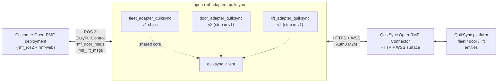
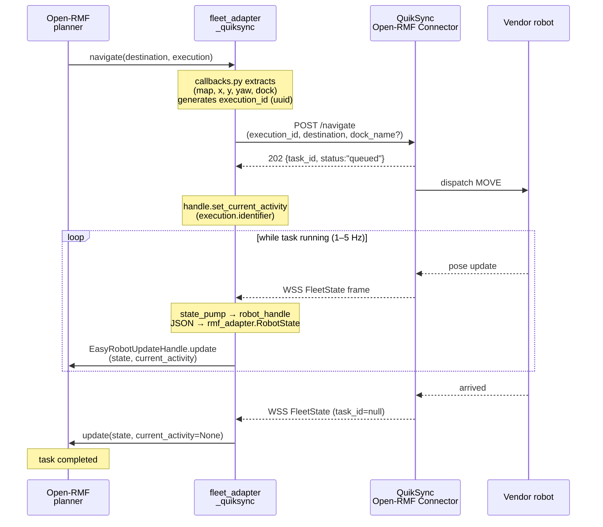

# open-rmf-adapters-quiksync

ROS 2 [Open-RMF](https://www.open-rmf.org/) adapters for the **QuikSync** platform — exposing QuikSync-managed robots, doors, and lifts to a customer's Open-RMF deployment as native peers.

The adapters consume the **QuikSync Open-RMF Connector** — an HTTP + WSS
surface served from the customer's QuikSync host — and surface the
underlying fleets, doors, and lifts to Open-RMF via the standard
`rmf_fleet_adapter`, `rmf_door_msgs`, and `rmf_lift_msgs` interfaces.

## Description

The QuikSync Open-RMF Connector exposes a stable HTTP + WSS surface for Open-RMF integration:

- `GET https://<your-quiksync-host>/api/v1/connector/open-rmf/discovery` — enumerates the fleets, doors, and lifts visible to the calling organisation.
- `GET https://<your-quiksync-host>/api/v1/connector/open-rmf/building_map` — the customer's `building.yaml` as JSON, mirroring `rmf-web`'s `/building_map` shape.
- `POST https://<your-quiksync-host>/api/v1/connector/open-rmf/fleets/{fleet}/robots/{robot}/{navigate,stop,perform_action}` — dispatch endpoints, idempotent on `execution_id`.
- `WSS  wss://<your-quiksync-host>/api/connector/ws/open-rmf/fleets/{fleet}/state/subscribe` — server-pushed `FleetState` frames.
- Auth0 M2M client-credentials for authentication; `?access_token=<jwt>` query parameter on WSS, `Authorization: Bearer` on REST.

This repo packages three Python adapters that drive that surface from a customer's ROS 2 + `rmf_ros2` deployment. There is one adapter process per role — fleet, door, lift — each consuming a config file with the QuikSync endpoint, Auth0 credentials, and the resource identity (`fleet_name` / `door_name` / `lift_name`) to register.

### Architecture



### How a task flows end-to-end

A typical `go_to_place` task, dispatched by the Open-RMF planner and serviced by `fleet_adapter_quiksync`:



`stop()` and `action_executor()` follow the same outbound shape (POST + idempotent on `execution_id`); state-side correlation via the WSS stream is identical.

## Packages

| Package | Status | Purpose |
|---|---|---|
| [`quiksync_client`](packages/quiksync_client) | shared core | Auth0 M2M `client_credentials` flow with token caching + preemptive refresh, `httpx`-based REST client with retries and jittered backoff, `websockets`-based state subscriber with 401 circuit-breaker. Used by all three adapter packages. |
| [`fleet_adapter_quiksync`](packages/fleet_adapter_quiksync) | v1 ships | Open-RMF `EasyFullControl` adapter — registers QuikSync-managed fleets with the customer's Open-RMF deployment; serves `RobotCallbacks(navigate, stop, action_executor)` against the QuikSync HTTP surface and pushes per-robot state from the WSS stream into `EasyRobotUpdateHandle`. |
| [`door_adapter_quiksync`](packages/door_adapter_quiksync) | v2 — stub in v1 | `rmf_door_msgs` adapter for QuikSync-managed doors. Stub binary ships in v1 so docker-compose deployments don't need to special-case "fleet only." |
| [`lift_adapter_quiksync`](packages/lift_adapter_quiksync) | v2 — stub in v1 | `rmf_lift_msgs` adapter for QuikSync-managed lifts. Same stub-ships-in-v1 rationale. |

The internal ament package names follow the Open-RMF community convention `<role>_adapter_<vendor>` so they list cleanly in [`open-rmf/awesome_adapters`](https://github.com/open-rmf/awesome_adapters). The repository name is plural because it holds three adapter packages.

## Pre-requisites

- ROS 2 **Jazzy** (the v1 target distro)
- `rmf_internal_msgs >= 2.3` (for `MODE_ADAPTER_ERROR` reporting)
- `rmf_ros2` source build or binary install with the Python bindings
  (`rmf_fleet_adapter_python`) available on the host running the adapter
- Python 3.10+
- An Auth0 M2M client provisioned by QuikSync ops, with:
  - audience: `https://<your-quiksync-api-audience>/open-rmf`
  - scopes: `open-rmf:read open-rmf:invoke`
  - the corresponding Auth0 organisation ID for your tenant
- At least one registered fleet (and optionally doors / lifts) visible to your
  organisation via the QuikSync adapter API's `/discovery` endpoint

Additional distros (Iron, Humble) are not officially supported in v1. We add
distros per customer demand.

## Setup

Source-build alongside your `rmf_ros2` workspace:

```bash
# Source Open-RMF as an underlay
source ~/rmf_ws/install/setup.bash

# Create + populate a workspace for the QuikSync adapters
mkdir -p ~/quiksync_ws/src
cd ~/quiksync_ws/src
git clone git@github.com:quikbot/open-rmf-adapters-quiksync.git

# Resolve dependencies and build
cd ~/quiksync_ws
rosdep install --from-paths src --ignore-src --rosdistro jazzy -yr
colcon build --packages-select \
  quiksync_client fleet_adapter_quiksync \
  door_adapter_quiksync lift_adapter_quiksync
```

A multi-stage [`Dockerfile`](docker/Dockerfile) is provided that builds all four packages on top of `ros:jazzy-ros-base`. See [`docker/docker-compose.yaml.example`](docker/docker-compose.yaml.example) for a reference compose configuration.

## Configuration

`fleet_adapter_quiksync` is configured via YAML (file path passed to the launch file) or environment variables (prefix `FLEET_ADAPTER_`). File config wins when both are present.

| Key | Type | Required | Description |
|---|---|---|---|
| `base_url` | string | yes | The HTTPS endpoint for your QuikSync deployment, e.g. `https://<your-quiksync-host>`. |
| `auth0_tenant` | string | yes | Auth0 tenant subdomain, e.g. `<your-auth0-tenant>.auth0.com`. |
| `auth0_audience` | string | yes | Auth0 audience for the QuikSync adapter API, e.g. `https://<your-quiksync-api-audience>/open-rmf`. |
| `auth0_client_id` | string | yes | The M2M client ID provisioned by QuikSync ops. |
| `auth0_client_secret` | string | yes\* | The M2M client secret. **Prefer `auth0_client_secret_file`** below; inlining the secret is convenient for development but discouraged in production. |
| `auth0_client_secret_file` | path | — | Path to a file containing the M2M client secret. Resolved at config-load and replaces `auth0_client_secret`. Recommended for production (Docker secret mount, k8s `Secret`, Vault projection, etc.). |
| `auth0_organization` | string | yes | The Auth0 organisation ID (`org_xxxxx`) corresponding to your tenant on QuikSync. |
| `fleet_name` | string | yes | The fleet identifier to register with Open-RMF. Must match a fleet visible to your organisation via the QuikSync adapter API's `/discovery` endpoint. |
| `update_interval_seconds` | float | — | How often `EasyRobotUpdateHandle.update()` is invoked per robot. Default `0.5`. |
| `state_subscribe_reconnect_seconds` | float | — | Base backoff after a WSS disconnect. Default `1.0` (with jittered exponential ramp, capped at 30s). |

\* Either `auth0_client_secret` or `auth0_client_secret_file` must be supplied. Use the file form in production.

See [`packages/fleet_adapter_quiksync/config/quiksync.yaml.example`](packages/fleet_adapter_quiksync/config/quiksync.yaml.example) for a copy-and-fill template.

## Run

### Dry-run mode (no `rmf_adapter` required)

Verifies auth + HTTP + WSS plumbing end-to-end without needing the `rmf_ros2`
stack. Useful for CI smoke and dev sanity checks.

```bash
python -m fleet_adapter_quiksync.adapter --config /path/to/quiksync.yaml --dry-run
```

Exits `0` when at least one WSS state frame arrived within 3 seconds; non-zero
otherwise. Use this in container-readiness probes if you want to fail fast on
auth or routing misconfiguration before the full adapter loop comes up.

### Full run (real `rmf_ros2` deployment)

```bash
source /opt/ros/jazzy/setup.bash
source ~/quiksync_ws/install/setup.bash

ros2 launch fleet_adapter_quiksync fleet_adapter_quiksync.launch.xml \
    config:=/etc/quiksync/fleet.yaml \
    client_id:=$ADAPTER_CLIENT_ID \
    client_secret_file:=/run/secrets/quiksync_adapter_credentials
```

A combined launch that includes future v2 door + lift roles is provided at
[`launch/quiksync_all.launch.xml`](launch/quiksync_all.launch.xml). In v1 it
launches the fleet adapter only; v2 packages slot in when they ship.

### Docker

```bash
docker compose -f docker/docker-compose.yaml.example up -d
```

Override the image tag, env vars, and config-volume path to match your
environment. ROS DDS prefers `network_mode: host`; the example sets it.

## Additional notes

### Authentication

The adapter implements the OAuth 2.0 `client_credentials` flow against the
Auth0 tenant configured for your QuikSync deployment. The token is cached in
memory and refreshed preemptively at ~80% of its TTL so the WSS connection
doesn't have to interrupt for a re-handshake. A 3-strike circuit breaker
trips after three consecutive 401s within 60 seconds — the adapter then stops
reconnecting and surfaces the failure, so a rotated-but-not-propagated secret
doesn't burn through the gateway's rate budget indefinitely.

WSS authentication uses the `?access_token=<jwt>` query parameter (browser
handshakes can't set `Authorization` headers; the WSS endpoint mirrors that
constraint for compatibility). Token rotation while a WSS connection is open
is not in-band — the adapter closes and re-handshakes when the cached token
approaches expiry.

### Named-place dispatch only (v1)

The adapter requires Open-RMF dispatches to resolve to a named waypoint in the
fleet's nav graph. Coordinate-only dispatches return `400 coord_navigate_not_supported`
from the QuikSync server. The 400 body carries a `diagnostic` block naming the
nearest waypoint and its distance, which the adapter surfaces to Open-RMF as
the failure message.

### Battery units

QuikSync exposes battery state as `battery_percent` on a 0–100 scale. Open-RMF's
internal `RobotState` carries the battery as an SOC fraction on a 0–1 scale.
The adapter divides by 100 at the translation boundary; no operator action
required.

### Dock vs. navigate

Open-RMF's `Destination` carries the dock target as a `dock` field, not via a
separate callback. The QuikSync `/navigate` endpoint accepts an optional
`dock_name` field for exactly this case: when set, the server dispatches a
DOCK directive; when unset/empty, a MOVE. There is no separate `/dock`
endpoint exercised by this adapter.

### State coalescing

The server may coalesce WSS frames. Adapters must not assume one frame per
upstream event. Typical observed load is 1–5 Hz per fleet.

### Idempotency

All POSTs (`/navigate`, `/stop`, `/perform_action`) are idempotent on the
caller-supplied `execution_id`. The adapter generates a fresh UUIDv4 per
dispatch; repeats with the same `execution_id` return the original 202
response unchanged. This is what makes the adapter's retry policy safe.

## Smoke testing

See [`docs/smoke.md`](docs/smoke.md) for the dry-run + full-Open-RMF smoke
procedure used to validate a release against a staging deployment. The doc
includes failure tables for the four most common diagnostic paths.

## Contributing

See [`CONTRIBUTING.md`](CONTRIBUTING.md). The project follows DCO sign-off,
Conventional Commits, pull-request-first merging, and the
[OSRF policy on generative tools in contributions](https://github.com/openrobotics/osrf-policies-and-procedures/blob/main/OSRF%20Policy%20on%20the%20Use%20of%20Generative%20Tools%20(%E2%80%9CGenerative%20AI%E2%80%9D)%20in%20Contributions.md),
adopted verbatim.

## Support

For support on Open-RMF itself (bug reports, feature requests, ROS-side
integration questions), see the
[Open-RMF support guidelines](https://openrmf.readthedocs.io/en/latest/support/index.html).

For support specific to QuikSync — adapter behaviour, API contract questions,
new fleet onboarding — contact QuikSync at
[tech@quikbot.ai](mailto:tech@quikbot.ai).

## License

Apache 2.0 — see [LICENSE](LICENSE).
