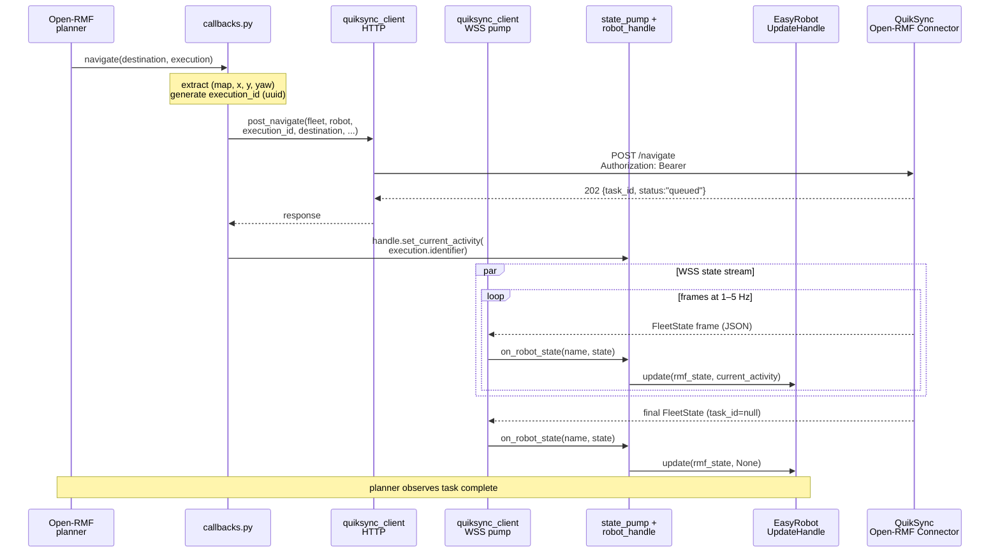

# fleet_adapter_quiksync

Open-RMF `EasyFullControl` fleet adapter for QuikSync-managed fleets.

Registers a QuikSync-managed fleet with the customer's Open-RMF deployment
as a native peer: each robot in the fleet receives an `EasyRobotUpdateHandle`
into which the adapter pushes state (battery, location, current activity),
and Open-RMF dispatches tasks to the fleet through standard `RobotCallbacks`
(`navigate`, `stop`, `action_executor`) that the adapter routes back to the
QuikSync server.

## Architecture

```mermaid
flowchart TB
  subgraph server ["QuikSync Open-RMF Connector"]
    direction LR
    rest["REST<br/>GET /discovery<br/>GET /building_map<br/>POST /navigate<br/>POST /stop<br/>POST /perform_action"]
    wss["WSS<br/>/fleets/&#123;f&#125;/state/subscribe"]
  end

  subgraph pkg ["fleet_adapter_quiksync"]
    direction TB
    builder["binding.py<br/>discovery → FleetConfiguration<br/>building_map → Graph"]
    pump["state_pump.py<br/>WSS frame loop<br/>per-robot dispatch"]
    handle["robot_handle.py<br/>per-robot state cache<br/>JSON → rmf_adapter.RobotState"]
    callbacks["callbacks.py<br/>navigate / stop /<br/>action_executor factories"]
  end

  efc["rmf_adapter.Adapter<br/>EasyFullControl<br/>= native Open-RMF peer"]

  rest -->|"GET"| builder
  wss ==>|"stream"| pump
  pump --> handle
  handle -->|"update(state, activity)"| efc
  efc -->|"callbacks"| callbacks
  callbacks -->|"POST"| rest
  builder --> efc
```



- **Outbound** (Open-RMF → QuikSync): `navigate(Destination, execution)` from
  the planner is translated to `POST /navigate` with the destination's
  `(map, x, y, yaw)` and optional `dock_name` / `speed_limit`. Same shape
  for `stop()` and `action_executor(category, description, execution)`.
- **Inbound** (QuikSync → Open-RMF): the WSS state stream pumps `FleetState`
  frames into a per-robot `RobotHandle`, which translates the JSON into
  an `rmf_adapter.RobotState` and calls `EasyRobotUpdateHandle.update(...)`.
  No symmetric "update_robot" callback — state push is the only direction.

### Task lifecycle (sequence)



`stop()` and `action_executor()` route through the same callback → HTTP →
state-pump-correlation pattern.

## Layout

```
fleet_adapter_quiksync/
├── adapter.py        # entry point; wires the pieces below + ROS spin loop
├── binding.py        # rmf_adapter lazy-import boundary; constructs
│                     # VehicleTraits / BatterySystem / Graph /
│                     # FleetConfiguration; calls add_robot per robot
├── callbacks.py      # factories for navigate / stop / action_executor
├── config.py         # YAML + env config loader (FleetAdapterConfig)
├── robot_handle.py   # per-robot state cache + Open-RMF-side push
└── state_pump.py     # WSS frame loop, per-robot dispatch
```

## Runtime modes

- **`--dry-run`** — bootstraps Auth0 + HTTP + WSS, fetches `/discovery`,
  drains a few WSS frames, then exits. Useful for CI smoke (rmf_adapter
  is not installable without rmf_ros2) and operator pre-flight checks. No
  ROS context is initialised in this mode. Exit code is `0` if at least
  one WSS state frame arrived within 3 seconds, non-zero otherwise.
- **Full (default when `rmf_adapter` is importable)** — initialises
  `rclpy`, fetches `/building_map`, constructs the `EasyFullControl`
  fleet, registers each robot via `add_robot(...)` with its
  `RobotCallbacks`, spawns the WSS state pump on a dedicated thread, and
  blocks on `adapter.spin()` until SIGINT.

The runtime mode is chosen automatically: full when `rmf_adapter` is
importable, dry-run otherwise. `--dry-run` forces dry-run regardless.

## Configuration

See the [root README's Configuration section](../../README.md#configuration)
for the full reference table.

The minimum required keys: `base_url`, `auth0_tenant`, `auth0_audience`,
`auth0_client_id`, `auth0_client_secret` (or `auth0_client_secret_file`),
`auth0_organization`, `fleet_name`.

Template: [`config/quiksync.yaml.example`](config/quiksync.yaml.example).

## Run

See the [root README's Run section](../../README.md#run) for the launch
recipes (dry-run, full, docker).

A package-local launch file is provided at
[`launch/fleet_adapter_quiksync.launch.xml`](launch/fleet_adapter_quiksync.launch.xml).

## Tests

```bash
pytest packages/fleet_adapter_quiksync/test
```

The suite covers configuration parsing, callback factories, robot-handle
state translation, the state pump, and the `binding.py` wire-up (via
`sys.modules` injection of a fake `rmf_adapter` — the real binding's
correctness against the actual `rmf_ros2` API is verified by the live
smoke).

## Exit codes

The adapter binary's exit code communicates the failure category for
ops triage:

| Code | Meaning |
|---|---|
| `0` | Clean shutdown (SIGINT, or dry-run with frames=N>0). |
| `1` | Config load failed (missing keys, unparseable YAML, secret-file not readable). |
| `2` | Dry-run timed out without a single WSS frame. |
| `3` | `/discovery` fetch failed (auth, network, or scope). |
| `4` | The configured `fleet_name` was not found in `/discovery`'s `fleets[]`. |
| `5` | _(no longer used)_ |
| `6` | `rclpy` not importable in full-run mode. |
| `7` | `BindingError` — bad nav graph, missing fleet, unsupported `rmf_adapter` API surface. |

## License

Apache 2.0 — see the root [`LICENSE`](../../LICENSE).
