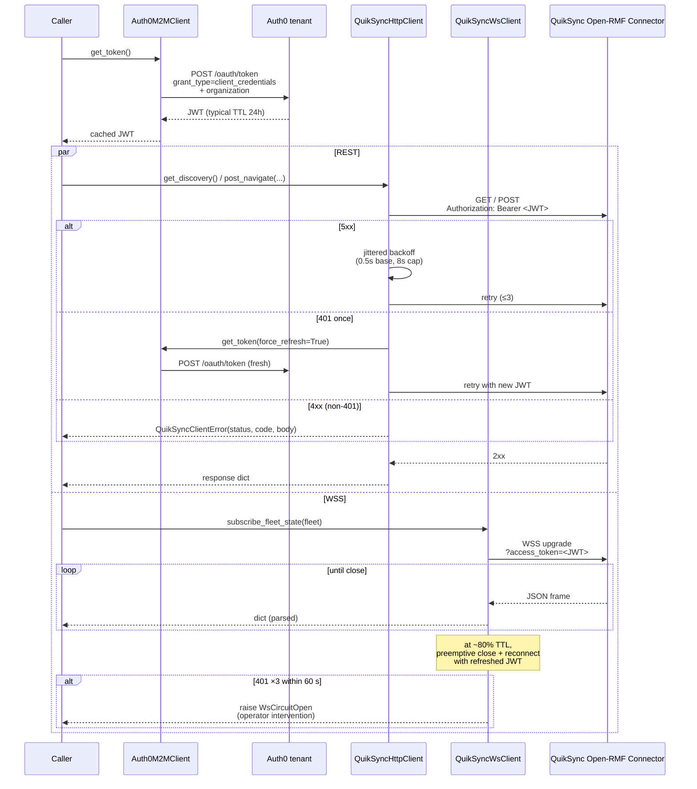

# quiksync_client

Shared Python core for talking to the **QuikSync Open-RMF Connector** (the
HTTP + WSS surface served from a customer's QuikSync host). Used by the
fleet, door, and lift adapter packages in this repository.

This package has no entry-point binary — it is a library only.

## What it provides

- **Auth0 M2M client** — OAuth 2.0 `client_credentials` flow against the
  configured Auth0 tenant, with in-memory token caching and preemptive
  refresh at ~80% of the JWT TTL.
- **HTTP client** — `httpx`-based REST client for the Connector's
  `GET` (`/discovery`, `/building_map`, `/fleets/{fleet}/state`,
  `/tasks/{task_id}/state`) and `POST` (`/navigate`, `/stop`,
  `/perform_action`) endpoints. Retries 5xx with jittered exponential
  backoff (0.5s base, 8s cap); never retries 4xx; one
  force-refresh-then-retry on 401.
- **WSS client** — `websockets`-based state subscriber for
  `/fleets/{fleet}/state/subscribe` (and `/doors/{door}/...` and
  `/lifts/{lift}/...`). Reconnects with backoff on transport failure; trips
  a circuit breaker after 3 consecutive 401s within 60 seconds.
- **Typed Pydantic response models** in [`quiksync_client.types`](quiksync_client/types.py)
  matching the documented HTTP wire shapes. Strict (`extra="forbid"`) on
  responses we own; permissive on rmf-web-derived shapes that may evolve
  upstream.

## Public surface

| Symbol | Purpose |
|---|---|
| `Auth0M2MClient`, `AuthConfig`, `AuthError` | Token minting + caching. |
| `QuikSyncHttpClient`, `HttpConfig` | REST client. |
| `QuikSyncClientError`, `QuikSyncServerError`, `QuikSyncConnectionError` | Structured exception hierarchy for 4xx / 5xx / transport failures. |
| `QuikSyncWsClient`, `WsConfig`, `WsCircuitOpen` | WSS subscriber. |
| `quiksync_client.types` | Pydantic models for the documented response shapes. |

## Use

```python
from quiksync_client import (
    AuthConfig, Auth0M2MClient,
    HttpConfig, QuikSyncHttpClient,
    WsConfig, QuikSyncWsClient,
)

auth = Auth0M2MClient(AuthConfig(
    tenant="<your-auth0-tenant>.auth0.com",
    audience="https://<your-quiksync-api-audience>/open-rmf",
    client_id="...",
    client_secret="...",
    organization="org_...",
))

http = QuikSyncHttpClient(HttpConfig(base_url="https://<your-quiksync-host>"), auth)
discovery = http.get_discovery()
# {"fleets": [...], "doors": [...], "lifts": [...]}

ws = QuikSyncWsClient(WsConfig(base_url="wss://<your-quiksync-host>"), auth)
async for frame in ws.subscribe_fleet_state("service_robots"):
    handle_state_frame(frame)
```

## Auth + reconnect flow



## Configuration

All three clients accept frozen dataclasses (`AuthConfig`, `HttpConfig`,
`WsConfig`). Tunable knobs include retry counts, backoff base/cap, circuit-
breaker window, and preemptive-reconnect threshold. See each dataclass's
docstring for defaults and constraints.

## Tests

```bash
pytest packages/quiksync_client/test
```

The suite is pure-unit + structural. The WSS-end-to-end behaviour is
covered by the live-smoke procedure in [`docs/smoke.md`](../../docs/smoke.md)
rather than CI.

## License

Apache 2.0 — see the root [`LICENSE`](../../LICENSE).
